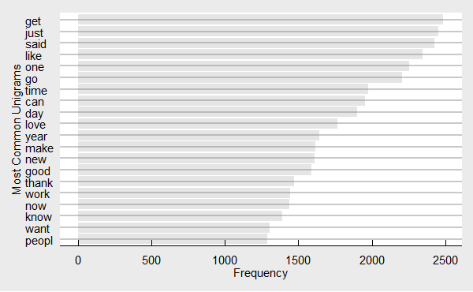
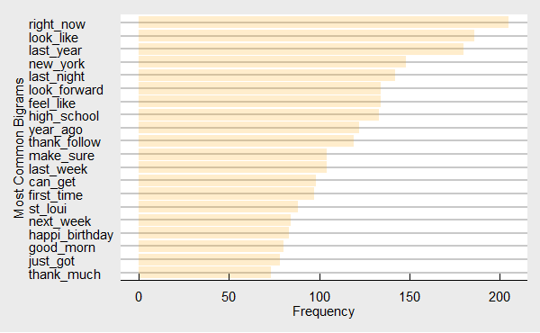
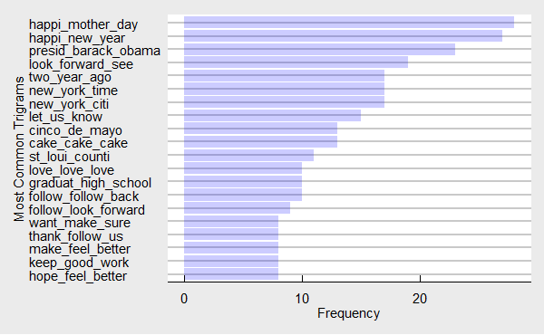

## Introduction

This milestone report is a part of the **data science** capstone project of [Coursera](https://www.coursera.org, https://www.coursera.org/learn/data-science-project/home/week/2) and [Swiftkey](http://swiftkey.com/). The main objective of the capstone project is to transform corpora of text into a **Next Word Prediction** system, based on word frequencies and context, applying data science in the area of **natural language processing**. 
This Rmarkdown report describes exploratory analysis of the sample training data set and summarizes plans for creating the prediction model. Text mining R packages **tm**[1] and **quanteda**[2] are used for cleaning, preprocessing, managing and analyzing text. This report meets the following requirements:  

* Downloads, loads the data, creates sample training data and preprocess it.  

* Generates summary statistics about the data sets and makes basic plots such as histograms to illustrate features of the data.  

* Describes some interesting findings.  

* Reports plans for creating a prediction algorithm and Shiny app.  

## Data Acquisition and Summary Statistics

### Data Source  
The text data for this project is offered by **coursera-Swiftkey**, including three types of sources: blogs, news and twitter with four different languages. The English - United States data sets will be used in this report.  

### Load the libraries

The R packages used here include: quanteda, tm, stringi, downloader, readr, stringr, dtplyr, tibble, ggplot2, rmarkdown, knitr, and ggthemes. 

### Download and Load the Course Data Sets

Download the data and save to local disk:  

```
[1] "../data_capstone/final/en_US/en_US.blogs.txt"  
[2] "../data_capstone/final/en_US/en_US.news.txt"   
[3] "../data_capstone/final/en_US/en_US.twitter.txt"
```
### Summary Statistics about the Data Sets


file_name            file_size (Mb)   word_count   line_count   Max words/line   Avg words/line
------------------  ---------------  -----------  -----------  ---------------  ---------------
en_US.blogs.txt                 200     37272578       899288            40832               42
en_US.news.txt                  196     34309642      1010242            11384               34
en_US.twitter.txt               159     30341028      2360148              140               13
Total                           555    101923248      4269678            40832               24

### Load the text Data in R and remove non-ASCII characters


### Sampling the Data for exploratory analysis   
In order to enable faster data processing, a data sample from all three sources was generated, extracting 0.01 of data randomly using **rbinoma()** function and store them. 


```
# A tibble: 3 x 2
  `sample text` length
  <chr>          <int>
1 sblog           6278
2 snews           8721
3 stwit          22982
```

## Data Cleaning and Preprocessing

### Loading bad-word list from [here](https://raw.githubusercontent.com/shutterstock/List-of-Dirty-Naughty-Obscene-and-Otherwise-Bad-Words/master/en)


### Create a tm corpus from three kinds of samples


### Clean and transform the corpus using stringi() and tm_map() 
The cleaning and preprocessing include:   

* convert to lowercase
* remove stopwords: c("will", quanteda::stopwords("english")
* remove profanity and other bad words
* remove URL: (http, https, atp, www and followings)
* remove twitter hash tag and email id
* remove Symbols
* remove Punctuation including Hyphens using tm::removePunctuation
* remove Numbers 
* Stem words using tm::stemDocument (Porter’s stemming algorithm)
* remove white space  


### Converting tm corpus to quanteda corpus


```
sample quanteda corpus: 
```

```
Corpus consisting of 37981 documents, showing 5 documents:

  Text Types Tokens Sentences       datetimestamp id language
 text1     3      3         1 2019-02-23 23:39:29  1       en
 text2    10     10         1 2019-02-23 23:39:29  2       en
 text3     9     10         1 2019-02-23 23:39:29  3       en
 text4    21     26         1 2019-02-23 23:39:29  4       en
 text5    17     27         1 2019-02-23 23:39:29  5       en

Source: Converted from tm Corpus 'tcorps'
Created: Sat Feb 23 18:40:53 2019
Notes: 
```

## N-grams and dfm (sparse Document-Feature Matrix)
### Creating dfm for n-grams
In statistical Natural Language Processing (NLP), an n-gram is a contiguous sequence of n items from a given sequence of text or speech. Bigram and trigram are combination of two and tree words respectively. We will build and use n-gram model, a type of probabilistic language model, for predicting the next item in such a sequence in the form of a (n − 1)–order Markov model.

#### Unigram

```
Document-feature matrix of: 37,981 documents, 34,525 features (100.0% sparse).
```
#### Bigram

```
Document-feature matrix of: 37,981 documents, 315,159 features (>99.99% sparse).
```
#### Trigram

```
Document-feature matrix of: 37,981 documents, 350,471 features (>99.99% sparse).
```

### Most common ngrams
#### The most common unigrams


```
 [1] "get"   "just"  "said"  "like"  "one"   "go"    "time"  "can"   "day"   "love"  "year"  "make" 
[13] "new"   "good"  "thank" "work"  "now"   "know"  "want"  "peopl"
```


<div class="rimage center"></div>


#### The most common bigrams
 


```
 [1] "right_now"      "look_like"      "last_year"      "new_york"       "last_night"    
 [6] "look_forward"   "feel_like"      "high_school"    "year_ago"       "thank_follow"  
[11] "make_sure"      "last_week"      "can_get"        "first_time"     "st_loui"       
[16] "next_week"      "happi_birthday" "good_morn"      "just_got"       "thank_much"    
```
<div class="rimage center"></div>


#### The most common trigrams  
 


```
 [1] "happi_mother_day"    "happi_new_year"      "presid_barack_obama" "look_forward_see"   
 [5] "two_year_ago"        "new_york_time"       "new_york_citi"       "let_us_know"        
 [9] "cinco_de_mayo"       "cake_cake_cake"      "st_loui_counti"      "love_love_love"     
[13] "graduat_high_school" "follow_follow_back"  "follow_look_forward" "make_feel_better"   
[17] "thank_follow_us"     "want_make_sure"      "hope_feel_better"    "keep_good_work"     
```

<div class="rimage center"></div>

 
## Some Observations and Issues in the Exploritary Analysis

1. The three corpora of US english text are around 200, 196, and 159 Megabytes respectively. The twitter corpus has shorter lines, not exceeding 140 "words" per line; while the blogs has the longest line. 

2. Bigrams and trigrams should be formed within a sentence, not crossing the sentences. 

3. Cleaning and other preprocessing may make the sentence boundaries vague or destroyed. We may use special tokens to mark the beginning and ending of each sentence before converting to lower case.  

4. Trigrams such as "follow_follow_back" and "love_love_love" should not happen by the ngrams functions. Need to avoid them Or filter them.

5. Word stemming is necessary, but it may result in something like "peopl", "citi", "happi", "good_morn", "st_loui_counti", "cinco_de_mayo". Restoring some stemmed words might need a lot of work. Any better ways?

6. Removing the stopwords is necessary concerning the memory size and speed. But the stopwords might be necessary to get real world phrases in the final next-word prediction.

7. Data size, memory, speed and accuracy are the challenges, especially for very limited resources (such as x86-64, windows 7 with 8GB RAM).

## Plans for creating a prediction algorithm and Shiny app

1. Split the original data randomly into training, held-out and test data set with 60%, 20% and 20% ratio. 

2. Rewrite the cleaning and preprocessing functions. Tokenize as "sentence" at first before converting to lower case and removing punctuation. Find out better ways to handle "stemming" and "stopwords" issues. 

3. Clean and preprocess the training, held-out and test sets exactly the same way.  Test data should not be touched in the model building process, but should have the same feature variables as training data. But in the reality the test data may have words that are not in the training sets. (Please correct me if my understanding is incorrect.)  

4. Create unigrams, bigrams and trigrams from the training data.  Remove singletons and sparse terms.

5. Want to build an interpolated modified Kneser-Ney smoothing next word prediction model. Will try to compile on Windows 7 the `KenLM` package (in C++), which seems superior in memory demand, performance, accuracy and speed. But `KenLM` is not found in CRAN. Any suggestion?

6. Apply the model to the held-out data set to evaluate and tune the model.

7. Apply the word prediction model to the test data sets to predict the next word.

8. Create a shiny App and publish it at "shinyapps.io" server.

Any corrections and suggestions would be deeply appreciated. 
 
## References:
[1] Ingo Feinerer and Kurt Hornik (2017). tm: Text Mining Package. R package version 0.7-1. https://CRAN.R-project.org/package=tm; Ingo Feinerer, Kurt Hornik, and David Meyer (2008). Text Mining Infrastructure in R. Journal of Statistical Software 25(5): 1-54. URL: http://www.jstatsoft.org/v25/i05/.

[2] Benoit, Kenneth and Paul Nulty. (2017). "quanteda: Quantitative Analysis of Textual Data". R package version: 0.9.9-24. URL https://github.com/kbenoit/quanteda;
https://cran.r-project.org/web/packages/quanteda/index.html; http://quanteda.io/articles/development-plans.html

## Appendix
* The Rmarkdown code index.Rmd can be found in [my github repository](https://github.com/SrilakshmiUppalapati/milestone-report)

* Session Info

```
R version 3.5.2 (2018-12-20)
Platform: x86_64-w64-mingw32/x64 (64-bit)
Running under: Windows 10 x64 (build 17134)

Matrix products: default

locale:
[1] LC_COLLATE=English_United States.1252  LC_CTYPE=English_United States.1252   
[3] LC_MONETARY=English_United States.1252 LC_NUMERIC=C                          
[5] LC_TIME=English_United States.1252    

attached base packages:
[1] stats     graphics  grDevices utils     datasets  methods   base     

other attached packages:
 [1] quanteda_1.4.0 tm_0.7-6       NLP_0.2-0      ggthemes_4.1.0 ggplot2_3.1.0  tibble_2.0.1  
 [7] dplyr_0.8.0.1  stringr_1.4.0  readr_1.3.1    stringi_1.3.1  downloader_0.4 knitr_1.21    

loaded via a namespace (and not attached):
 [1] Rcpp_1.0.0          pillar_1.3.1        compiler_3.5.2      plyr_1.8.4         
 [5] stopwords_0.9.0     tools_3.5.2         digest_0.6.18       lubridate_1.7.4    
 [9] lattice_0.20-38     evaluate_0.13       gtable_0.2.0        pkgconfig_2.0.2    
[13] rlang_0.3.1         fastmatch_1.1-0     Matrix_1.2-15       cli_1.0.1          
[17] yaml_2.2.0          parallel_3.5.2      xfun_0.5            withr_2.1.2        
[21] xml2_1.2.0          hms_0.4.2           grid_3.5.2          tidyselect_0.2.5   
[25] data.table_1.12.0   glue_1.3.0          R6_2.4.0            fansi_0.4.0        
[29] rmarkdown_1.11      spacyr_1.0          purrr_0.3.0         magrittr_1.5       
[33] SnowballC_0.6.0     ISOcodes_2019.02.13 scales_1.0.0        htmltools_0.3.6    
[37] assertthat_0.2.0    colorspace_1.4-0    labeling_0.3        utf8_1.1.4         
[41] RcppParallel_4.4.2  lazyeval_0.2.1      munsell_0.5.0       slam_0.1-44        
[45] crayon_1.3.4       
```


 
